## Hi! 👋 I'm Mingyun Kang.

I'm a master's student in Industrial Data Engineering at [BAE LAB](https://pnubaelab.github.io/), Pusan National University, advised by Prof. Hyerim Bae. My research focuses on **process mining**: discovering, monitoring, and predicting process behavior from event data, the fine-grained records from which most operational data originate.

**🔬 Research Interests**
- Predictive Process Monitoring
- Process Anomaly Detection
- Agentic AI for Process Mining

## Papers

- **PaCT: Patch-Based Multi-Channel Transformer for Predictive Process Monitoring**  
  **Mingyun Kang**, Yongjae Lee, Kibeom Park, Hyerim Bae  
  *ICICIC 2026*

- **PaCHITA: A Patched Channel-Independent Transformer for Business Process Anomaly Detection**  
  Yongjae Lee, **Mingyun Kang**, Hyerim Bae  
  *ASPAI 2026* — Best Paper Runner-up Award

## 🎉 Awards

-  KOSSDA 대학생 데이터 시각화 공모전 — 2026
-  보훈 공공데이터·AI 활용 아이디어 공모전 — 2026
-  지·산·학 연계 산업수학 데이터 탐구 경진대회 — 2025
-  B.D.A × 동서발전 × 60Hz 풍력 발전량 예측 공모전 — 2025
-  공공데이터 활용 가족정책 아이디어 공모전 — 2024

## Background

- M.S. Industrial Data Engineering, Pusan National University — 2026.08 – present
- B.S. Statistics, Pusan National University — 2022.03 – 2026.08
- Intern, Dongnam Regional Statistics Office — 2024.06 – 2024.12

---

   <a href="mailto:alsrbs3345@gmail.com">alsrbs3345@gmail.com</a> &nbsp;&nbsp;
   +82 10-7564-7880 &nbsp;&nbsp;
   <a href="https://nneans.github.io">nneans.github.io</a>

